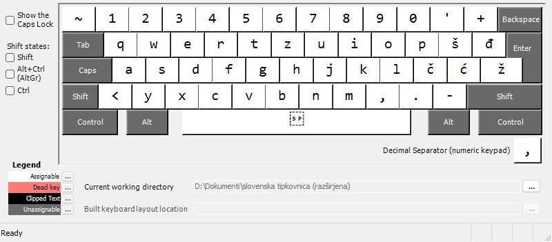
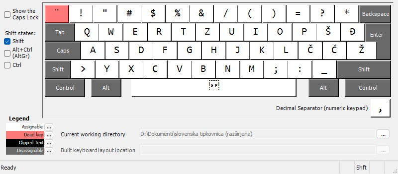
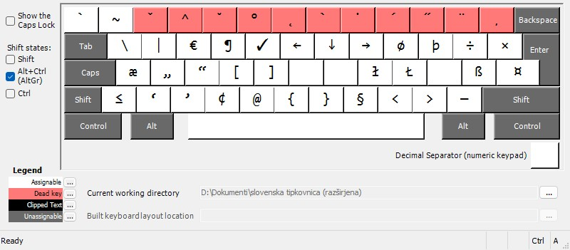
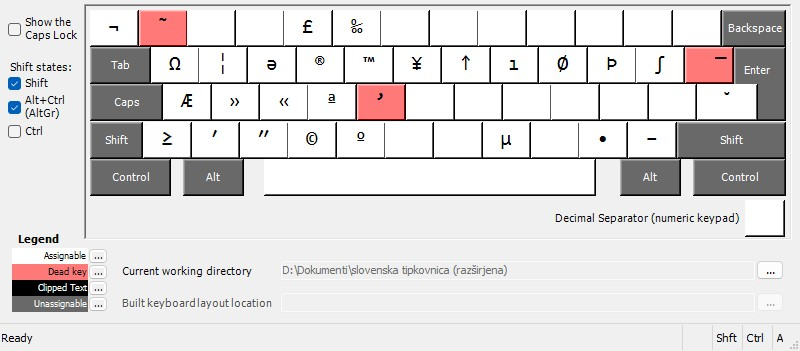
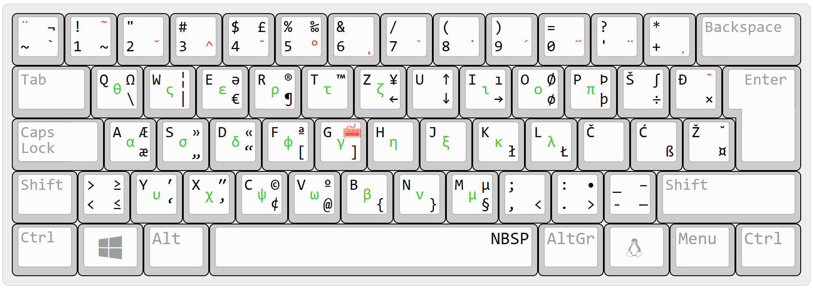

# Slovenska tipkovnica za Windows, ki približno temelji na Linux postavitvi

Dolgo časa sem razmišljal, kako bi se dalo čim enostavneje napisati čim več znakov. Kot ljubitelj makro tipkovnic in AHK sem to reševal na različne načine, nikoli mi pa ni padlo na pamet, da bi naredil svojo postavitev.

Nato mi je enkrat v naročje padla [~Linux postavitev](https://github.com/tamius-han/slo-linux-keyboard-layout-for-windows), na kateri temelji moja predelava. Ker nekako vedno padam v raznorazne zajčje luknje, sem nato našel [nemško razširjeno postavitev](https://en.wikipedia.org/wiki/German_extended_keyboard_layout), ki ima v primerjavi z osnovno slovensko ene milijonkrat več znakov. To me je navdihnilo, da sem naredil en odcep in malo popravil, malo razširil razpored.

## Glavne spremembe glede na osnovno slovensko razporeditev

Verjetno bo sprememb še kaj, ampak v grobem so spremembe sledeče:

- Krativec ``(`)`` se zdaj obnaša kot krativec, torej je "mrtva tipka".
- Uradna Linux postavitev je bolj za navdih kot za vodilo, kjer se mi je zdelo smiselno, sem dodal predloge, drugod sem dodal znake po svoje:
	- različni narekovaji (`„ ″ ’ «`)
	- nekateri matematični znaki (`‰ ∫ ≤ ≥ ¬ ≈`)
	- nekateri slovnični znaki (`º ª ə`)
- Grške črke preko svoje mrtve tipke (dosegljiva prek `AltGr`+`Shift`+`G`).
- Drugo:
	- podpisane številke (0-9, +, -, =, oklepaji) so dosegljive prek `AltGr`+`2`, nato pritisneš številko
	- nadpisane številke (0-9, +, -, =, oklepaji) so dosegljive prek `AltGr`+`3`, nato pritisneš številko
	- nedeljiv presledek je na `AltGr`+`Shift`+`presledek`
	- `≈` dobiš s kombinacijo `˜` in `~`, `≡` pa s `¯` in `=`
	- itd.
- Kaj me še čaka:
 	- [x] grške črke
	- [ ] matematični znaki
	- [ ] drugo (po navdihu)

## Razporeditev

Rdeči znaki so mrtve tipke, zeleni so grške črke.

#### Brez dodatnih tipk

#### Shift

#### AltGr

#### AltGr in Shift

#### Lepša slika ;)

Spodaj levo je samo tipka, zgoraj levo dobiš s `Shift`, spodaj desno potrebuje `AltGr`, zgoraj desno pa `AltGr`+`Shift`. Na sredini so zelene grške črke.

--------

#### Za tiste, ki hočejo sami zapravljat čas

[Microsoft Keyboard Layout Creator (MSKLC) Version 1.4](https://www.microsoft.com/en-us/download/details.aspx?id=102134)

Jaz sem moral končni DLL skupaj spravit v virtualni Sedmici, mogoče bo kdo imel več sreče in mu bo delalo tudi na 11.
